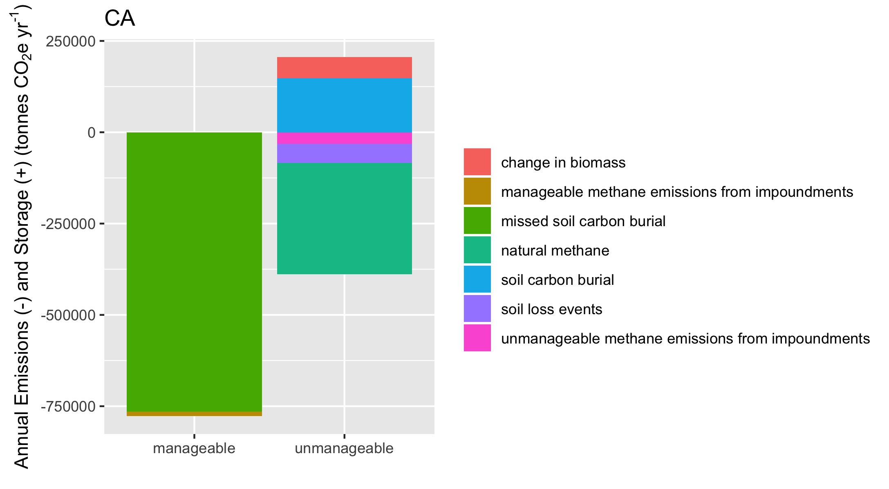
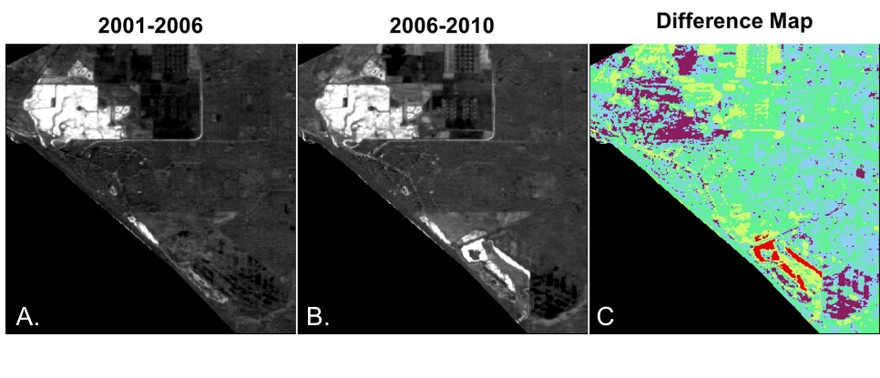

 
__Here are a few highlightes from recent papers and projects which show some simple and powerful visualizations of complex coastal wetland datasets.__
 

# Accuracy and Precision of Tidal Wetland Soil Carbon Mapping in the Conterminous United States

 

__Citation:__ Holmquist, J. R., Windham-Myers, L., Bliss, N., Crooks, S., Morris, J. T., Megonigal, J. P., ... & Ferner, M. C. (2018). Accuracy and Precision of Tidal Wetland Soil Carbon Mapping in the Conterminous United States. Scientific Reports, 8(1), 9478. https://doi.org/10.1038/s41598-018-26948-7

__Abstract:__ Tidal wetlands produce long-term soil organic carbon (C) stocks. Thus for carbon accounting purposes, we need accurate and precise information on the magnitude and spatial distribution of those stocks. We assembled and analyzed an unprecedented soil core dataset, and tested three strategies for mapping carbon stocks: applying the average value from the synthesis to mapped tidal wetlands, applying models fit using empirical data and applied using soil, vegetation and salinity maps, and relying on independently generated soil carbon maps. Soil carbon stocks were far lower on average and varied less spatially and with depth than stocks calculated from available soils maps. Further, variation in carbon density was not well-predicted based on climate, salinity, vegetation, or soil classes. Instead, the assembled dataset showed that carbon density across the conterminous united states (CONUS) was normally distributed, with a predictable range of observations. We identified the simplest strategy, applying mean carbon density (27.0 kg C m^−3^), as the best performing strategy, and conservatively estimated that the top meter of CONUS tidal wetland soil contains 0.72 petagrams C. This strategy could provide standardization in CONUS tidal carbon accounting until such a time as modeling and mapping advancements can quantitatively improve accuracy and precision.

 

## Variability in Coastal Carbon Stocks

 
  
{width=6.25in}
  
 

## Efficacy of Mapping Techniques

 
  
![Target Diagrams as outlined by Joliff et al. The x-axis represents unbiased root mean square error (RMSE’), a metric of precision. RMSE’ closer to 0 indicate greater precision. RMSE’ is artificially signed to show whether the modeled (m) or reference (r) dataset has the greater standard deviation (σ). The y-axis shows Bias, a metric of accuracy. Bias values closer to 0 indicate greater accuracy. Positive values indicate the model values are too high, negative values indicate model values are too low. The circles represent total root mean square error (RMSE). All indices have been standardized (\*) by σr. RMSE\* values less than 1 σr (bold circle) indicate that the model performs better than the average of the reference dataset. Thinner circles represent RMSE* values of 2, 3, and 4 σr for reference.](images/Target Diagrams 3p75 by 7p25 180304.jpg){width=3.75in}  

 
 
 

# Uncertainty in United States coastal wetland greenhouse gas inventorying

 

__Citation__: Holmquist, J.R., Windham-Myers, L., Bernal, B., Byrd, K. B., Crooks, S., Gonneea, M. E., Herold, N., Knox, S. H., Kroeger, K., McCombs, J., Megonigal, J. P., Meng, L., Morris, J. T., Sutton-Grier, A. E., Troxler, T. G., Weller, D. E. (2018). Uncertainty in United States coastal wetland greenhouse gas inventorying. Environmental Research Letters. https://doi.org/10.1088/1748-9326/aae157.

__Abstract__: Coastal wetlands store carbon dioxide (CO2) and emit CO2 and methane (CH4) making them an important part of greenhouse gas (GHG) inventorying. In the contiguous United States CONUS), a coastal wetland inventory was recently calculated by combining maps of wetland type and change with soil, biomass, and CH4 flux data from a literature review. We assess uncertainty in this developing carbon monitoring system to quantify confidence in the inventory process itself and to prioritize future research. We provide a value-added analysis by defining types and scales of uncertainty for assumptions, burial and emissions datasets, and wetland maps, simulating 10 000 iterations of a simplified version of the inventory, and performing a sensitivity analysis. Coastal wetlands were likely a source of net-CO2-equivalent (CO2e) emissions from 2006–2011. Although stable estuarine wetlands were likely a CO2e sink, this effect was counteracted by catastrophic soil losses in the Gulf Coast, and CH4 emissions from tidal freshwater wetlands. The direction and magnitude of total CONUS CO2e flux were most sensitive to uncertainty in emissions and burial data, and assumptions about how to calculate the inventory. Critical data uncertainties included CH4 emissions for stable freshwater wetlands and carbon burial rates for all coastal wetlands. Critical assumptions included the average depth of soil affected by erosion events, the method used to convert CH4 fluxes to CO2e, and the fraction of carbon lost to the atmosphere following an erosion event. The inventory was relatively insensitive to mapping uncertainties. Future versions could be improved by collecting additional data, especially the depth affected by loss events, and by better mapping salinity and inundation gradients relevant to key GHG fluxes. Social Media Abstract: US coastal wetlands were a recent and uncertain source of greenhouse gasses because of CH4 and erosion.

 

## Uncertainty in Total Flux Scenario

 
  
![CONUS inventory results of 10,000 Monte Carlo simulations, shaded to distinguish simulations resulting in a net-emission (orange) or a net-storage (blue) scenario. The thick gray vertical line at 0 separates these scenarios. Points indicate medians, and black horizontal lines the upper and lower 95% confidence intervals. Top panels separate fluxes from estuarine and palustrine wetlands, and from wetlands that were lost from those that were stable or gained area. The bottom panel shows net-annualized emissions from 2006–2011.](images/6 Monte Carlo Histogram Results 3p5 by 6 180808.jpg){width=3.5in}

 

## Top 15 Sources of Uncertainty 

 
  
{width=6in}

 
 
 

# U.S. Climate Alliance Natural and Working Lands Learning Lab

 

__Presented__: Holmquist JR, J Fargione, K Kroeger, JP Megonigal, D Weller, L Windham-Myers (2018).  Opportunities for Wetland Greenhouse Gas Emission Reduction from Coastal States in the Contiguous U.S. American Geophysical Union (AGU), D.C.

__Abstract__: In the U.S., many former tidal wetlands have limited tidal connection with the sea, causing salinity to decline to the point where CH4 emissions increase. Many wetlands drained for farming or other uses emit more CO2 as soil decays and elevation is lost. We estimated the potential for reconnecting tidal flow to these tidal wetlands in order to avoid CH4 emissions and reestablish soil carbon burial. For each coastal state in the contiguous U.S., we mapped natural, partially drained, impounded, and farmed wetlands falling within the range of intertidal elevation. We estimated all fluxes associated with soil carbon burial or loss, biomass change, and methane emission. We categorized each flux as either manageable or unmanageable, according to whether or not there is a direct restoration activity that might lower emissions or restart carbon burial. For all contiguous U.S. states, we mapped 0.66 million hectares of restorable wetlands, and we estimate 847 million tonnes of carbon are buried in the top 1 m of soil in natural wetlands. Of the manageable emissions, the vast majority come from the missed opportunity for carbon burial in partially drained coastal wetlands and wetlands converted to farmland. States with notable proportions of low elevation farmed areas include California and Washington. Partially drained wetlands are a prominent landcover type in North Carolina and New Jersey. States with relatively high proportions of low elevation impounded wetlands include California and Oregon. Future iterations of this analysis will include uncertainty and sensitivity analyses of the datasets and assumptions employed in order to establish levels of confidence and prioritize future research efforts. Future iterations will also include an assessment of the cost to benefit ratio of restoring wetlands from a carbon market perspective. The present results are a first cut establishing the scales and patterns of coastal restoration opportunities for coastal state-level stakeholders that seek to manage natural and working lands to reduce greenhouse gas emissions.

 

## Single State

 
  
{width=5in}

 

## All Climate Alliance States

 
  
{width=5in}

 

## Example Infographic
  
 
  
{width=7in}

 
 
 

# Coastal Mappping Projects

 

__Note__: These figures represent summaries of in progress work. Please contact James Holmquist for any questions you may have. Please ask for permission before redistributing. 

 

## Tidal Restoration Mapping

 
  
{width=7in}

 

## Seasonal Vegetation Monitoring

 
  
{width=7in}

 
